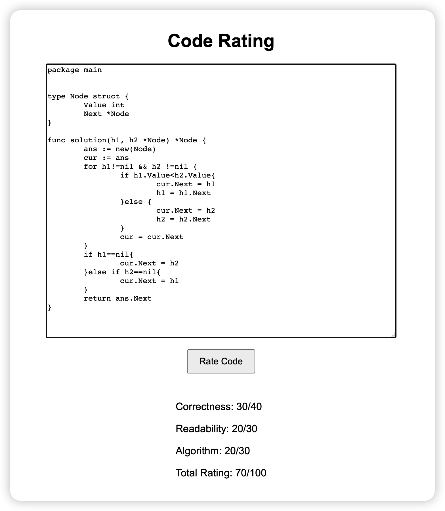

# Code Rating Web App

Code Rating is an open-source web application that utilizes OpenAI's text-davinci-002 model to rate code snippets based on correctness, readability, and algorithm. It provides a user-friendly interface for automated code interviews.



## Features

- Evaluate Golang code snippets based on the following criteria:
  - Correctness (0-40): Does the code run without errors and produce the expected output?
  - Readability (0-30): Is the code easy to read and understand?
  - Algorithm (0-30): Is the algorithm used efficient and well-implemented?
- Calculate the total score out of 100.
- Display the individual ratings for correctness, readability, and algorithm, as well as the total score.
- Easy-to-use web interface.

## Installation

### Clone the repository

```bash
git clone https://github.com/edgenesis/code-rating.git
```

### Change to the project directory

```bash
cd code-rating
```

### Install dependencies

This project requires Python 3.6+ and Flask. If you don't have Python 3.6+ installed, you can download it from the [official website](https://www.python.org/downloads/). Then, install Flask using pip:

```bash
pip3 install Flask
```

### Set up your OpenAI API key

You need to have an OpenAI API key to use the GPT-3.5-turbo model. Sign up for an API key on the [OpenAI website](https://www.openai.com/). Once you have the API key, set the environment variable:

```bash
export OPENAI_API_KEY=your_api_key_here
```

## Usage

1. Start the web app

```bash
python3 score.py
```

2. Open your web browser and visit `http://localhost:8080`.

3. Paste your code snippet into the textarea, and click the "Rate Code" button.

4. The ratings for correctness, readability, and algorithm, as well as the total score, will be displayed below the button.

## Contributing

We welcome contributions to the Golang Code Rating project! Please follow these steps to contribute:

1. Fork the repository.
2. Create a new branch for your changes.
3. Make your changes and commit them to your branch.
4. Push your changes to your fork.
5. Open a pull request with a clear description of your changes.

## License

This project is licensed under the GNU Affero General Public License v3.0. See the [LICENSE](LICENSE) file for more information.

## Disclaimer

Please note that the OpenAI model, is not perfect, and the ratings provided may not always accurately reflect the quality of the code snippet. You may want to fine-tune the model or adjust the prompt for better results.
